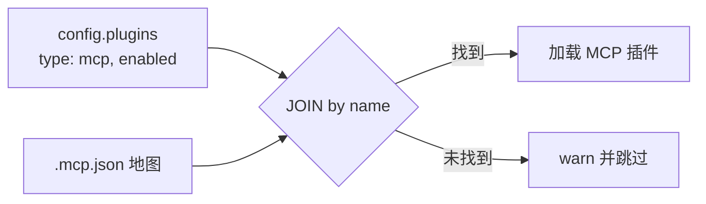

# nano-code

轻量级终端 AI 编程助手。极简核心 + 插件驱动架构，通过自然语言与代码仓库交互。

## 快速开始

```bash
# 安装依赖
npm install

# 直接运行（无需编译）
npx tsx src/index.ts
```

首先在项目目录创建 `.env` 文件，配置 LLM API Key：

```env
# ── 必需 ──
OPENAI_API_KEY=sk-xxx                      # 你的 API Key
OPENAI_BASE_URL=https://api.openai.com/v1  # 可选，默认 OpenAI；可换为 DeepSeek / 通义千问 / Ollama 等
OPENAI_MODEL_NAME=gpt-4o                   # 可选，默认 gpt-4o

# ── 可选（按需添加）──
TAVILY_API_KEY=tvly-xxx                    # Web 搜索功能，需要 Tavily API Key
```

不配置 `OPENAI_API_KEY` 时将无法启动。

```bash
# 编译并全局安装 release 版本（安装后可直接使用 nano-code 命令）
npm run build
npm install -g .
nano-code

# 或仅编译后运行（不全局安装）
npm run build
npm start
```

## 命令行选项

| 选项 | 说明 |
|------|------|
| `-d, --debug` | 开启调试模式，打印与 LLM 交互的完整数据包 |
| `-t, --think` | 显示 LLM 的思考过程 |
| `--skip-permission` | 跳过工具调用的用户确认提示 |
| `--list-plugins` | 列出所有已注册的插件及其提供的工具（含 agent 工具） |
| `-c, --continue` | 接续最近一次在当前项目的会话继续对话 |
| `-p, --profile <name>` | 指定 agent 角色配置文件（如 `treehole`），直接进入特定角色模式 |
| `--model <name>` | 指定使用的模型（名称或序号，需启用 model-registry 插件） |
| `--version` | 显示版本号 |
| `--help` | 显示帮助信息 |

### 内建斜杠命令

| 命令 | 说明 |
|------|------|
| `/exit`, `/quit` | 退出程序 |
| `/clear` | 清除对话历史，重新开始 |
| `/help` | 显示帮助信息 |
| `/compact`, `/compress` | 压缩对话历史 — 摘要旧消息以节省上下文空间 |
| `/context` | 查看上下文分布及用量（8 维度 + ContextVis 色块图） |
| `/plan` | 查看 Plan Mode 状态、当前计划内容 |
| `/task`, `/tasks` | 查看任务列表 |
| `/review` | 审查当前变更的正确性/性能/安全（Review 技能） |
| `/commit` | 创建 Git 提交，附带 nano-code 归属签名（Commit 技能） |
| `/commit-pr` | 提交变更 + 推送到远程 + 创建 Pull Request（Commit-PR 技能） |
| `/permissions` | 查看会话已允许免确认的工具列表 |
| `/permissions reset` | 清空权限 allowlist |
| `/doctor` | 诊断系统健康状态（配置、API 连通性、插件加载） |
| `/model [name]` | 查看/切换 LLM 模型（Ink 下为交互式选择器，需启用 model-registry 插件） |
| `/plugin`, `/plugins` | 管理插件 — `/plugin list`, `/plugin enable <name>`, `/plugin disable <name>` |
| `/init` | 初始化 nano-code.md — 分析项目结构并生成代码库文档 |

`/compact` 支持参数：`/compact --dry-run`（预览）、`/compact --preserve 3`（保留最近 3 组对话）、`/compact --model gpt-4o-mini`（指定总结模型），剩余参数作为自定义总结侧重指令。

### 自动压缩

自动压缩默认启用（`autoCompactEnabled: true`）。当 token 用量接近阈值时，LLM 自动对历史消息做摘要压缩，策略基于当前消息大小（而非累计总值），支持多次 slide window 压缩。压缩前全量备份至 `.nano-code-session.pre-compact.json`。

可通过配置文件关闭：
```yaml
plugins:
  token-budget:
    settings:
      autoCompactEnabled: false
```

### 插件管理命令

```bash
nano-code plugin list                          # 列出所有插件及状态（含 agent 插件 + MCP server）
nano-code plugin install <source>              # 安装插件（自动检测 NanoPlugin / DisplayPlugin / MCP）
nano-code plugin uninstall <name>              # 卸载插件（从所有配置文件中移除）
nano-code plugin mcp-add <name> [选项] [--] <command> [args...]  # 添加 MCP server
nano-code plugin autoscan                      # 从 ~/.claude/.mcp.json 导入 MCP server
nano-code plugin enable <name>                 # 启用插件或 agent
nano-code plugin disable <name>                # 禁用插件或 agent
nano-code doctor                               # 诊断运行环境健康状态
```

#### `plugin mcp-add`

```bash
nano-code plugin mcp-add my-server -- npx -y @modelcontextprotocol/server-filesystem
nano-code plugin mcp-add my-server --scope user -- npx -y my-mcp-package   # 写到 ~/.nano-code/.mcp.json
nano-code plugin mcp-add my-server --transport http --url http://localhost:8080
```

写入目标：`--scope user` → `~/.nano-code/.mcp.json`；默认（project）→ `$CWD/.mcp.json`。
命令会同时写入对应域的 `.mcp.json` 和 `config.plugins`（带 `type: mcp` 声明），确保 server 能被加载。

#### `plugin autoscan`

扫描 Claude Code 的 `~/.claude/.mcp.json`，将其中尚未在 nano-code 自有配置中的 MCP server 导入到 `~/.nano-code/.mcp.json`，同时在全局配置 `~/.nano-code/config.yaml` 的 `plugins` 段写入 `type: mcp` 声明。幂等安全，已导入的条目不会重复写入。

#### `plugin uninstall`

卸载插件：从所有配置文件中移除该插件的声明和启动配置。

```bash
nano-code plugin uninstall my-server           # 全局搜索，全部移除
nano-code plugin uninstall my-server --scope project   # 仅移除项目级配置
nano-code plugin uninstall my-server --scope user      # 仅移除用户级配置
```

不指定 `--scope` 时，搜索项目级和用户级的所有配置（`.nano-code.yaml` / `config.yaml` / `.mcp.json`），能找到的都删除。

系统插件（白名单）禁用/启用仅通过配置文件操作。

#### DisplayPlugin 安装

当安装的包同时提供 DisplayPlugin 接口时，`plugin install` 会自动检测并执行展示插件安装：

```bash
nano-code plugin install @scope/my-display-plugin
```

安装流程：
1. 检测到 DisplayPlugin（如 `onStreamChunk`、`onToolCall` 等展示特有方法）
2. 将主入口文件的**绝对路径 re-export** 写入 `~/.nano-code/presentations/<name>.mjs`
3. 在全局配置 `~/.nano-code/config.yaml` 的 `plugins` 段注册（默认 `enabled: false`）

安装后不会自动激活，需手动在项目配置文件设置：
```yaml
# .nano-code.yaml
display:
  plugin: my-display-plugin   # 引用 presentations/ 下的展示插件名
```

`plugin list` 会以 `[display]` 标签列出已安装的展示插件。`plugin uninstall` 会清理 `presentations/` 文件并移除配置条目。

> 展示插件文件名基于安装源派生（npm 取包名最后一段，git 取仓库名，本地取目录名），避免不同包的展示插件名冲突。

### 交互式插件管理

会话中通过 `/plugin` 斜杠命令管理插件：

- **REPL 模式**：`/plugin list` 查看列表，`/plugin enable <name>` / `/plugin disable <name>` 切换状态
- **Ink 模式**：直接输入 `/plugin` 进入交互式插件管理器，`↑↓` 选择、`Enter` 切换启用/禁用、`/` 搜索过滤、`Esc`/`q` 退出

更改需要重启 nano-code 或运行 `/reload-plugins` 后生效。

### 展示层配置

展示层（输入/输出 UI）可通过 `display` 配置。`display.enabled: false` 时自动切换到非交互式 `cli` 展示层：

```yaml
# ~/.nano-code/config.yaml
display:
  # plugin: repl              # 默认 REPL 交互（基于 @clack/prompts）
  plugin: claude-code-ink     # Ink 终端 UI（类 Claude Code 体验）
```

内置三个展示层插件：

| 插件 | 说明 |
|------|------|
| `repl` | 默认（交互式），基于 `@clack/prompts` + `console` 的 REPL 交互；流分页器（大输出分段展示）、plan mode `(plan)` 提示符前缀 |
| `claude-code-ink` | 基于 React + Ink 的全屏终端 UI，支持 ScrollBox 滚动、`--think` 思考内容灰色斜体区分、agent 前缀、keybinding 系统、多行输入（Shift+Enter / `\`+Enter 换行）、交互式问题对话框（自定义文本输入 + 确认）、ESC/Ctrl+C 关闭弹框等 |
| `cli` | 非交互式 CLI 展示，AI 响应输出到 stdout，状态/错误输出到 stderr；`display.enabled: false` 时的兜底方案 |

自定义展示插件可通过 `nano-code plugin install <source>` 安装，自动注册到 `~/.nano-code/presentations/`，设置 `display.plugin: <name>` 即可激活。详见 [DisplayPlugin 安装](#displayplugin-安装)。

### 快捷键

`claude-code-ink` 模式下内置 keybinding 系统：

| 快捷键 | 等待输入时 | 执行中 |
|--------|-----------|--------|
| `Shift+Tab` | 切换 normal/plan 模式（仅 Ink 模式） | — |
| `Ctrl+C` | 退出程序 | 取消当前操作（中断 LLM + 停止 agent） |
| `Escape` | 退出程序 | 取消当前操作 |
| `↑`/`↓`（单行输入） | 历史命令浏览 | — |
| `↑`/`↓`（多行输入） | 在输入行间移动光标，到首/末行再进历史 | — |
| `Shift+Enter` | 插入换行（多行输入） | — |
| `\` + `Enter` | 反斜杠换行：删除 `\` 并插入 `\n` | — |
| `PageUp`/`PageDown` | 滚动浏览历史消息 | 滚动浏览历史消息 |
| `Tab` | 命令名补全 / 补全建议切换 | — |
| `@<agent名>` | 切换到对应 agent 的子视图（仅 Ink 模式） | — |
| `Esc`（子视图中） | 返回主视图 | — |
| `↑`/`↓`（子视图中） | 切换上一个/下一个 agent 视图 | — |
| `Esc`（弹框中） | 权限弹框 → 拒绝并终止；问题弹框 → 取消 | 取消操作 |
| `Ctrl+C`（弹框中） | 关闭弹框 + 终止当前 ReAct 过程 | 取消操作 |

`repl` 模式下 `Ctrl+C` 在等待输入时由 `@clack/prompts` 处理（退出程序），执行中通过 SIGINT 处理器取消当前操作。

`--think` 模式下思考内容以灰色斜体渲染，与正常输出形成视觉区分。

### 权限系统

fs/command 等有副作用的工具调用会触发权限确认弹窗（Ink 模式下为三选项 Select：**批准** / **始终允许**（会话级） / **拒绝**）。工具调用信息先展示，再弹出确认：

1. 用户看到 `🔧 toolName(args)` 调用信息
2. 权限弹窗展示，选择批准/始终允许/拒绝
3. 拒绝时也会显示被拒绝的工具调用记录

会话内通过 `/permissions` 查看已允许的工具列表，`/permissions reset` 清空 allowlist。

子 agent 内部自动跳过权限确认（`skipPermission: true`），避免阻塞自动化流程。

展示层插件不通过 `plugin-cli` 管理，独立于 PluginRegistry。未配置时默认使用 `repl`，`display.enabled: false` 时自动切换到 `cli` 展示层。

### Agent 生命周期事件

`DisplayPlugin` 支持 agent 任务生命周期事件，方便 UI 插件感知 agent 状态变化：

```typescript
interface DisplayPlugin {
  // ... 基础事件
  onAgentTurnStart?(event: AgentEvent): void;  // agent 开始处理
  onAgentTurnEnd?(event: AgentEvent): void;    // agent 完成一轮处理
  onStateSnapshot?(snapshot: StateSnapshot): void; // 状态快照（含 messageCount）
  onBackgroundTask?(event: BackgroundTaskEvent): void; // 后台任务状态变更
  setStatusBar?(segments: Record<string, string>): void; // 状态栏段落更新
  onNotify?(notification: NotifyEvent | null): void; // 瞬态通知消息（如 cron 任务完成）
}
```

`BackgroundTaskEvent` 结构：

```typescript
interface BackgroundTaskEvent {
  agentName: string;
  taskId: string;
  taskStatus: 'started' | 'completed' | 'error';
  message: string;
}
```

Store 中的 `agent` key 自动更新 agent 运行状态：

```typescript
registry.store.get('agent')
// → { agentName: 'main', status: 'running'|'idle', messageCount: 10 }
```

`NotifyEvent` 结构：

```typescript
interface NotifyEvent {
  source: string;   // 消息来源（如 cron）
  message: string;  // 通知文本
}
```

通知消息通过 `DisplayManager.setNotify(source, message)` 广播给所有 display 插件，在 Ink 状态栏右侧循环展示（超出宽度自动截断）。可选后端 `notify-manager` 插件提供通知队列管理（每源 FIFO、轮询调度、2s 间隔）。

## 配置

### 环境变量（`.env`）

```env
# ── 必需 ──
OPENAI_API_KEY=sk-xxx                      # LLM API Key
OPENAI_BASE_URL=https://api.openai.com/v1  # 可选，默认 OpenAI
OPENAI_MODEL_NAME=gpt-4o                   # 可选，默认 gpt-4o

# ── 可选 ──
TAVILY_API_KEY=tvly-xxx                    # Web 搜索功能（需要注册 Tavily）
```

不配置 `OPENAI_API_KEY` 时无法启动 LLM，应用将报错退出。
支持任何兼容 OpenAI API 格式的后端：DeepSeek、通义千问、Ollama 本地模型等。

环境变量加载顺序（高优先级优先）：
1. Shell 环境变量
2. `$CWD/.env` — 项目级环境变量
3. `~/.nano-code/.env` — 全局兜底

### agent 角色配置

自定义 agent 的身份和启动提示：

```json
{
  "agent": {
    "role": "数据库管理员",
    "greeting": "我可以帮您查询数据库、分析表结构。"
  }
}
```

不配置时自动推导：有已注册工具 → "终端 AI 编程助手"，无工具 → "AI 对话助手"。

### 配置文件（`.nano-code.yaml`）

项目级 YAML 配置，可覆盖模型参数、agent 角色和插件设置：

```yaml
core:
  model: deepseek-chat
  apiKey: sk-xxx
  baseURL: https://api.deepseek.com/v1
  maxTokens: 128000     # 默认上下文窗口大小
  defaultTimeout: 120000

agent:
  role: DevOps 助手

plugins:
  fs: {}
  command: {}
  token-budget:
    settings:
      maxTokensPerSession: 100000
      autoCompactEnabled: true      # 超出阈值时自动压缩（默认 true）
      autoCompactThreshold: 90000   # 可选，默认 maxTokensPerSession * 0.9

skills:
  disabled:
    - debug
    - stuck
  # disableSkillTool: true   # 完全禁用 skill/skills_list/skill_view 工具
```

配置文件优先级高于 `.env` 文件。`apiKey` 和 `baseURL` 也可以在配置文件中指定，不配置时从 `.env` 或环境变量读取。`model`、`temperature` 等参数为可选项，不配置时使用默认值。`skills` 段在启动时检查，运行时修改需要重启生效。

### 全局 YAML 配置（`~/.nano-code/config.yaml`）

首次启动时自动创建，包含系统插件白名单、环境变量、提示词模板等。编辑后重启生效：

```yaml
# 系统插件白名单 — CLI enable/disable 不可操作
system_plugins:
  - fs
  - command
  - memory
  - token-budget
  - file-search
  - ~~monitor~~
  - mcp-loader

# 环境变量兜底（shell 和 .env 优先级更高）
env:
  OPENAI_API_KEY: ""
  OPENAI_BASE_URL: ""

# 系统提示词模板（可用变量 {role} {tool_list}）
system_prompt:
  with_tools: |
    你是一个名为 nano-code 的 {role}。...
  no_tools: |
    你是一个名为 nano-code 的 {role}。...
```

项目级 `.nano-code.yaml` 会覆盖全局 YAML 配置。插件默认不加载，只有在配置中显式声明才会被注册（系统白名单内的插件除外）。

### Agent Profile 角色配置

通过 `--profile` 参数直接启动 nano-code 进入特定角色模式：

```bash
nano-code --profile treehole
```

Profile 文件查找顺序：项目目录 `.nano-code/profiles/<name>.json` → 全局 `~/.nano-code/profiles/<name>.json`，优先级最高的配置层可覆盖 agent 角色、插件启停和插件设置。

示例（`~/.nano-code/profiles/treehole.json`）：
```json
{
  "agent": {
    "role": "一个善解人意的树洞，温柔地倾听用户的心声",
    "greeting": "你好，我是树洞。你可以放心地说任何事情。"
  },
  "plugins": {
    "memory": {
      "enabled": true,
      "settings": { "namespace": "treehole" }
    },
    "command": { "enabled": false }
  }
}
```

Profile 可以禁用不需要的默认插件（如树洞禁用 fs/command），使 nano-code 从"编程助手"变为任意角色。

### Agent 工具子 agent

调用领域专家子 agent 完成特定任务，子 agent 拥有独立的插件集合和上下文历史：

```bash
# 在 ~/.nano-code/agents/ 下创建 YAML 定义，自动注册为工具
nano-code --list-plugins
# → agent:dba [内置]  • agent-dba  数据库专家，分析慢查询和索引优化
```

Agent 定义文件（`~/.nano-code/agents/dba.yaml`）：

```yaml
name: dba
description: 数据库专家，分析慢查询和索引优化
role: |
  你是一个专业的数据库管理员（DBA），擅长分析和优化 SQL 查询性能。
plugins:
  command:
    enabled: true
  memory:
    enabled: true
    settings:
      namespace: dba
```

主 agent 在对话中自动调用子 agent：

```
用户: "帮我看看这个查询为什么慢"
主 agent → 调用 agent-dba 工具
  [dba] ? 正在思考并请求大模型...
  [dba] # AI 申请调用本地工具: [ mysql_execute ]
  [dba] [OK] 工具执行完毕
  [dba] 分析结果：建议在 user_id 列上添加索引
主 agent → 根据结果向用户解释
```

特性：
- 自动发现 `~/.nano-code/agents/*.yaml`，注册为 `agent-<name>` 工具
- 子 agent 拥有独立 `PluginRegistry`，不共享主 agent 的插件
- 输出带 `[name]` 前缀，区分各 agent 的日志
- 递归防护：子 agent 内部不注册 agent 工具
- 子 agent 如需持久记忆，在定义中指定独立 `namespace`

### 后台执行

子 agent 支持异步后台执行，适用于耗时任务：

```bash
# 调用子 agent 时设置 run_in_background=true
# 主 agent 立即返回 taskId，无需等待子 agent 完成
agent-dba({ query: "分析慢查询", run_in_background: true })
# → { taskId: "task_1", agentName: "dba", status: "started" }
```

后台任务特性：
- 主 agent 可同时启动多个后台 agent，各自独立执行
- 后台 agent 完成后，结果自动注入到主 agent 的下一次 LLM 请求中
- 通过 `agent_task_status({ task_id? })` 工具查询单个或全部任务状态
- 后台任务状态在 `DisplayPlugin` 中以 `onBackgroundTask` 事件通知：
  - **REPL 模式**：打印 `[后台] agent名（taskId）...` 消息
  - **Ink 模式**：底栏显示 `BackgroundTaskBar`，实时展示运行/完成/失败状态，完成后 5 秒自动消失

### 并发工具执行

同一 LLM 轮次中，多个无副作用的工具（如 `view_file_content`、`search_code`）自动并行执行，减少总等待时间。有副作用的工具（`write_file`、`command` 等）保持串行执行，确保执行顺序和权限流程正确。

```
同一 LLM 轮次：
  read-only 工具:  ── view_file ──┐
                   ── search_code ──┤── Promise.all ──→ 下一轮 LLM
  write 工具:      ── write_file ────────────→ 串行执行
```

### Agent 间通信

运行中的 agent 可以通过 `send_message` 工具互相通信：

```bash
# 主 agent 给后台 agent 发送消息
send_message({ to: "task_1", summary: "提供上下文", message: "检查 users 表结构" })

# 后台 agent 给主 agent 回复
send_message({ to: "main", summary: "查询结果", message: "users 表有 3 个索引..." })
```

- `to` 参数支持 agent 名称（如 `"dba"`）或任务 ID（如 `"task_3"`）
- 消息在接收方下一次 LLM 请求时自动注入，`onBeforeRequest` 钩子处理
- 接收方在系统提示中看到 `## 新消息` 提示，消息内容自动注入为 user 角色消息
- `MessageBus` 单例管理所有信箱，agent 退出时自动清理

## 架构

```
┌─────────────────────────────────────────────────┐
│                   Core                           │
│  CLI → Agent Loop → PluginRegistry → LLM Client │
└─────────────────────────────────────────────────┘
         ↕ register & dispatch     ↕ shared state
┌──────────────────────────────────┴────────────────┐
│                  Plugins                           │
│  fs │ command │ memory │ MCP │ token-budget │ …  │
├───────────────────────────────────────────────────┤
│           Agent Coordinator                       │
│  src/plugins/coordinator/                         │
│  Agent 注册 / 后台执行 / send_message agent 间通信 │
│  AgentLifecycle / TaskManager / MessageBus        │
├───────────────────────────────────────────────────┤
│            Agent 工具（~/.nano-code/agents/）      │
│  agent:dba  │  agent:reviewer  │  …              │
└───────────────────────────────────────────────────┘
```

- **Core** (`src/core/`) — 核心引擎，零 UI 依赖。Agent 循环、LLM 通信、插件编排、配置管理、会话持久化、类型定义。通过 `src/core/index.ts` 暴露公共 API。
- **Display** (`src/display.ts`) — `DisplayPlugin` 接口 + `DisplayManager` 编排。核心层只依赖 `DisplayPlugin` 接口，不耦合具体实现。
- **Plugins** — 所有功能通过插件提供，Core 不内置任何业务工具。插件间通过 `IStore`（`registry.store`）共享状态，**禁止互相 import**。共享 key 集中声明于 `src/core/store-keys.ts`
- **Agent Coordinator** (`src/plugins/coordinator/`) — 统一管理 agent 工具注册、后台执行生命周期和 agent 间消息传递（`AgentLifecycle` / `TaskManager` / `MessageBus` 单例）
- **Agent 工具** — 领域专家子 agent，通过 `~/.nano-code/agents/*.yaml` 定义，自动注册为工具，独立上下文执行

### 内置插件

| 插件 | 启用方式 | 提供工具 |
|------|---------|---------|
| **fs** | `"fs": {}` | 文件列表、读取、写入、精准修改；文件读取缓存（最近 5 个文件，5 分钟 TTL）供 `/compact` 后恢复上下文 |
| **file-search** | 系统白名单自动启用 | 文件搜索（glob）+ 内容搜索（grep），支持正则和 glob 限定范围 |
| **command** | `"command": {}` | Bash 命令执行（含危险命令黑名单 + 权限确认弹窗） |
| **memory** | `"memory": {}` | 文件化记忆系统：MEMORY.md 索引 + topic 文件，onSystemPrompt 注入行为规则和索引，save_memory/recall_memory 工具，~/.nano-code/AGENT.md 用户全局偏好 |
| **skills** | 系统白名单自动启用 | 13 个内置 TypeScript 技能 + 文件系统 SKILL.md 技能，`skill`/`skills_list`/`skill_view`/`run_agent` 工具 |
| **store** | 内建默认 `InMemoryStore` | 插件间共享状态通道，`IStore` 接口可替换实现 |
| **model-registry** | `"model-registry": { settings: { models: [...] } }` | 声明多个 LLM 模型，`/model` 切换；支持 `$ENV_VAR` 语法隐藏密钥 |
| **agent** | 自动发现 `~/.nano-code/agents/*.yaml` | `agent-<name>` 子 agent 调用工具；`agent_task_status` 查询后台任务；`send_message` agent 间通信 |
| **task-plan** | 内建默认注册 | Plan Mode（`enter_plan_mode`/`exit_plan_mode`） + 任务系统（`task_create`/`task_list`/`task_update`/`task_stop`） |
| **display** | 通过 `display.plugin` 配置 | 展示层插件，支持生命周期事件（独立于 PluginRegistry） |

### 可选插件

| 插件 | 启用方式 |
|------|---------|
| **npm** | 配置 `type: "npm"` 和 `spec`，`import()` 加载 NanoPlugin |
| **MCP** | 配置 `type: "mcp"` 条目，自动加载外部 MCP Server |
| **Token Budget** | 配置 `plugins.token-budget.settings`，使用 API 精确 token 统计；支持自动压缩阈值 `autoCompactEnabled`（默认 `true`）/`autoCompactThreshold` |
| **Model Registry** | 配置 `plugins.model-registry.settings.models` 声明多个 LLM 模型，通过 `/model` 命令或 `--model` CLI 运行时切换 |
| **notify-manager** | 配置 `plugins.notify-manager.enabled: true` 启用。后端通知队列管理：每源 FIFO 队列、最大 5 条/源、轮询调度、2s 间隔循环推送；通过 store key `notify:send` 调用 |
| **npm-loader** | 内置默认插件，自动处理 `type: "npm" 插件的注册 |

## Plan Mode

Plan Mode 允许 LLM 在实施前先探索代码库并设计方案，经用户确认后再开始编码。适用于复杂任务。

### 工作流程

1. LLM 调用 `enter_plan_mode` 进入规划模式
2. 系统注入完整计划指令，内置 4 阶段工作流（探索 → 设计 → 审查迭代 → 执行）
3. LLM 使用 `plan_write` 工具将计划写入 `~/.nano-code/plan/<name>.md`
4. LLM 总结方案给用户，等待用户反馈或说"执行"
5. 用户说"执行"/"开始执行"后，LLM 调用 `exit_plan_mode` 返回计划内容，开始实施

### 安全机制

- **写入工具拦截**：plan mode 下所有 `sideEffect=true` 的工具（`write_file_content`、`patch_file`、`run_bash_command`）被 `onBeforeToolCall` 钩子拦截，LLM 无法执行任何写操作
- **退出限制**：LLM 不得自行调用 `exit_plan_mode`，必须在用户明确说"执行"/"开始执行"后才能退出
- **退出通知**：退出 plan mode 后自动注入 `<system-reminder>` 退出提醒，清除旧指令残留

### 提醒节流

plan mode 指令通过 `<system-reminder>` 注入，采用两级节流策略避免占用过多上下文：

| 轮次 | 内容 |
|------|------|
| 第 1 轮（首次进入） | 完整指令（4 阶段工作流 + 安全约束） |
| 第 2–5 轮 | 跳过（不注入） |
| 第 6 轮 | 完整版（首次周期性附件） |
| 第 7–10 轮 | 跳过 |
| 第 11–25 轮 | 精简版（"Plan mode still active..."） |
| 第 26 轮 | 再次完整版（每 5 次附件一次完整） |

### UI 指示

- **Ink 模式**: 底栏状态栏显示黄色 `● PLAN` 徽标 + 右侧 `(Shift+Tab)` 提示；非 plan 模式不显示 mode 指示
- **REPL 模式**: 提示符前缀显示 `[plan mode]`

### 斜杠命令

| 命令 | 说明 |
|------|------|
| `/plan` | 查看 plan 状态（模式、计划目录、已批准状态、任务进度） |
| `/plan list` | 列出 `~/.nano-code/plan/` 下所有计划文件 |
| `/plan show <name>` | 查看指定计划内容 |
| `/plan exec` | 向 LLM 注入"开始执行"指令 |
| `/plan exit` | 退出 plan mode |

## 任务/清单系统

通过 `task_create`/`task_list`/`task_update`/`task_stop` 工具管理任务清单，文件持久化于 `.nano-code/tasks/` 目录。

### 数据模型

```typescript
interface Task {
  id: string;          // 递增数字 ID
  subject: string;     // 标题
  description: string; // 描述
  activeForm?: string; // spinner 显示文本（如 "Running tests"）
  owner?: string;      // 负责人
  status: 'pending' | 'in_progress' | 'completed';
  blocks: string[];    // 阻塞的其他任务 ID
  blockedBy: string[]; // 被哪些任务 ID 阻塞
}
```

### 任务依赖

- `blockedBy`: 此任务被哪些任务阻塞（前置依赖）
- `blocks`: 此任务阻塞哪些任务（后置依赖）
- 通过 `task_update` 的 `addBlocks`/`addBlockedBy` 参数设置

### 斜杠命令

| 命令 | 说明 |
|------|------|
| `/task list` | 列出所有任务 |
| `/task <id>` | 查看单个任务详情 |

## MCP 集成

nano-code 支持 [Model Context Protocol](https://modelcontextprotocol.io/) 标准协议。
MCP 配置采用**双文件分离**设计，启动时按名称 JOIN：

```
config.plugins（.nano-code.yaml / config.yaml）→ 控制层：哪些 MCP server 启用
.mcp.json（nano-code 全局 / 项目 / Claude Code 兼容） → 数据层：如何启动（command/args/url）
```

### config.plugins 声明（必需）

在配置文件的 `plugins` 段声明 MCP server 启用状态。`type: mcp` 标记该条目为 MCP 插件，`enabled` 控制是否加载：

```yaml
# ~/.nano-code/config.yaml 或 $CWD/.nano-code.yaml
plugins:
  my-server:
    type: mcp          # 标记为 MCP 插件
    enabled: true      # 启用
```

> **注意**：`config.plugins` 只存放启用控制，不存放 transport 细节。transport 配置必须放在 `.mcp.json` 中。

### .mcp.json transport 配置

`.mcp.json` 文件存放 MCP server 的启动参数，支持三个来源，同名条目先到先得：

| 优先级 | 路径 | 说明 |
|--------|------|------|
| 最高 | `~/.nano-code/.mcp.json` | nano-code 自有全局配置 |
| 中 | `$CWD/.mcp.json` | 项目级配置 |
| 低 | `~/.claude/.mcp.json` | **只读兼容**，nano-code 不会写入此文件 |

```json
{
  "mcpServers": {
    "my-server": {
      "command": "npx",
      "args": ["-y", "@modelcontextprotocol/server-filesystem", "."]
    }
  }
}
```

### 启动加载逻辑

启动时，加载器会：

1. 扫描所有 `.mcp.json` 来源，合并为 server 地图（同名高优先级覆盖低优先级）
2. 遍历 `config.plugins` 中 `type: mcp` 且 `enabled` 的条目
3. 在 `.mcp.json` 地图中按名称查找 transport 配置 → 找到则加载，未找到则输出警告并跳过



说人话就是：**两个文件都要配**。
- 想开哪个 MCP server？→ `config.plugins` 写 `type: mcp, enabled: true`
- 怎么启动它？→ `.mcp.json` 写 `command` / `args` / `url`

### 管理命令

```bash
# 添加 MCP server（同时写入 .mcp.json + config.plugins）
nano-code plugin mcp-add my-server -- npx -y @modelcontextprotocol/server-filesystem
nano-code plugin mcp-add my-server --scope user -- npx -y my-mcp-package

# 从 Claude Code 批量导入
nano-code plugin autoscan

# 卸载（从所有配置中移除声明 + transport）
nano-code plugin uninstall my-server
nano-code plugin uninstall my-server --scope project
```

项目 `.mcp.json` 建议加入 `.gitignore`（路径、环境变量可能含敏感信息）。

### 迁移 Claude Code 的 MCP 插件

之前使用 Claude Code 已安装的 MCP server（如 `codebase-memory-mcp` 的 `install.sh` 写入 `~/.claude/.mcp.json`）：

```bash
nano-code plugin autoscan    # 一次性导入，补全 config.plugins 声明
```

部分 MCP server 的官方安装脚本也直接写入 `~/.claude/.mcp.json`。`autoscan` 会将其导入到 nano-code 自有配置并补全声明。如果不想导入，也可手动在 `config.plugins` 中写入声明后直接使用。

## 模型注册表（Model Registry）

通过 model-registry 插件在配置中声明多个 LLM 模型，运行时通过 `/model` 命令或 `--model` CLI 参数切换：

```yaml
plugins:
  model-registry:
    settings:
      models:
        - provider: openai
          model: gpt-4o
          apiKey: "$OPENAI_API_KEY"
          baseURL: "https://api.openai.com/v1"
          temperature: 0
        - provider: openai
          model: deepseek-chat
          apiKey: "$DEEPSEEK_API_KEY"
          baseURL: "https://api.deepseek.com/v1"
```

`apiKey` 和 `baseURL` 支持 `$ENV_VAR` 语法，从环境变量读取。`provider` 表示 API 兼容协议（`openai` / `anthropic`），非模型厂商。

### 运行时切换

- **`/model`** — 无参数进入交互式选择器（Ink 下方向键选择 + Enter 确认），REPL 回退文本列表
- **`/model deepseek-chat`** / **`/model 1`** — 按名称或序号直接切换
- **`--model deepseek-chat`** — 启动时指定模型

当 model-registry 插件未配置或未启用时，行为回退到环境变量方式（`OPENAI_API_KEY` / `OPENAI_BASE_URL` / `OPENAI_MODEL_NAME`）。

完整配置示例见 [`examples/configs/nano-code-full.yaml`](examples/configs/nano-code-full.yaml)。

## 插件开发

nano-code 的插件是一个实现 `NanoPlugin` 接口的模块，可以提供工具和钩子：

```typescript
interface NanoPlugin {
  name: string;
  description?: string;
  getTools(): ToolDefinition[];
  execute(name, args, ctx): Promise<ToolResponse>;
  onInit?(registry: PluginRegistry): Promise<void>;
  onDestroy?(): Promise<void>;
  onSystemPrompt?(prompt: string): string;
  onBeforeRequest?(messages): ChatMessage[];
  onAfterRequest?(response, rawMeta?): void;  // rawMeta 由插件自行解析
  onBeforeToolCall?(toolCall): ToolCall | null;
  onAfterToolCall?(result): ToolResponse;
  onExtraParams?(): Record<string, unknown>;  // 注入 LLM API 请求参数
  onAgentReady?(context: AgentReadyContext): Promise<void>;  // agent 创建后触发
  onAgentExit?(context: AgentExitContext): Promise<void>;    // agent 退出时触发（清理资源）
  onSessionRestore?(context: SessionRestoreContext): Promise<void>;  // --continue 恢复会话
}
```

**插件间共享状态通过 `IStore`（`registry.store`），禁止互相 import 运行时状态。**

```typescript
interface IStore {
  get<T>(key: string): T | undefined;
  set<T>(key: string, value: unknown): void;
  subscribe(key: string, fn: () => void): () => void;
}
```

- 写方插件在 `src/core/store-keys.ts` 注册 key，`onInit` 时写入
- 读方插件从 `registry.store.get<T>(SK.KeyName)` 读取
- 核心不定义值类型——读写双方约定 key 的语义和类型（`store-keys.ts` 仅声明 key 名）
- 纯数据常量（如提示词模板）可以直接导入，不属于"运行时状态"

默认实现为 `InMemoryStore`（`src/core/store.ts`），可替换为任何后端存储。

### 交互式工具桥接（InteractiveHandler）

工具插件需要用户交互时（如提问、确认），通过 `PluginRegistry` 提供的桥接机制与 display 插件协作：

```typescript
// Display 插件注册交互处理器
registry.registerInteractiveHandler('ask_user_question', async (args) => {
  const answers = await myDialog(args.questions);
  return { status: 'success', data: JSON.stringify({ questions: args.questions, answers }) };
});

// 工具插件调用 — display 接管 UI，无处理器则返回结构化数据供 LLM 自行呈现
const handler = registry.getInteractiveHandler('ask_user_question');
if (handler) return handler(args);
return { status: 'success', data: `[交互式提问] ...` };
```

- 类型安全：`InteractiveHandler = (args: any) => Promise<ToolResponse>`
- 零耦合：display 插件 import 类型（编译期擦除），不 import 工具插件运行时
- 优雅降级：无 display 注册处理器时，工具返回结构化 JSON，LLM 自行呈现并等待用户输入
- 可扩展：同模式支持 `confirm_dangerous_action`、`file_picker` 等未来交互工具

详细指南请参考 [`docs/plugin-development.md`](docs/plugin-development.md)。

## 测试

```bash
npm test         # 单元测试（677 项）
npm run test:e2e # E2E 测试（11 场景，覆盖 ReAct 全链路 + 并发执行 + 混合工具）
npm run test:all # 全部测试
```

E2E 测试使用 StubLLMClient 替代真实 LLM 调用，在临时目录中隔离执行，覆盖单工具流、多轮流、错误处理、权限门、取消、记忆插件和参数缺失等场景。

## 技术栈

TypeScript + Node.js 原生测试框架，通过 OpenAI 兼容 API 调用 LLM，使用 ReAct 循环模式 + 插件系统驱动工具调用。
