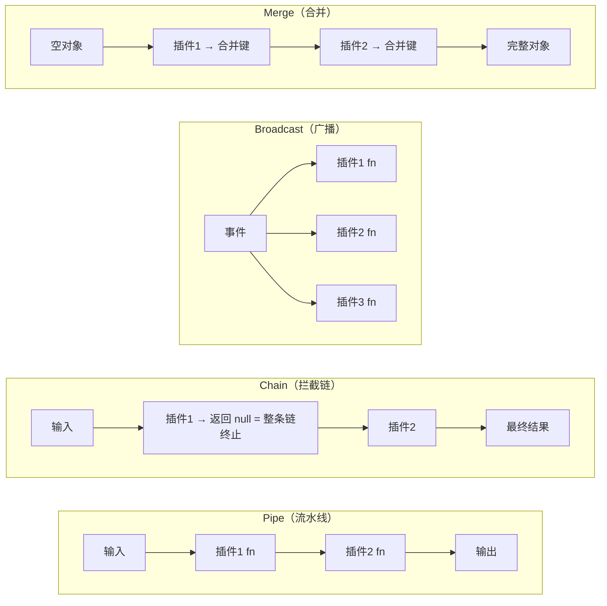
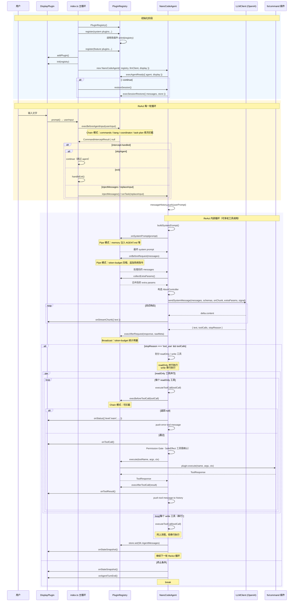
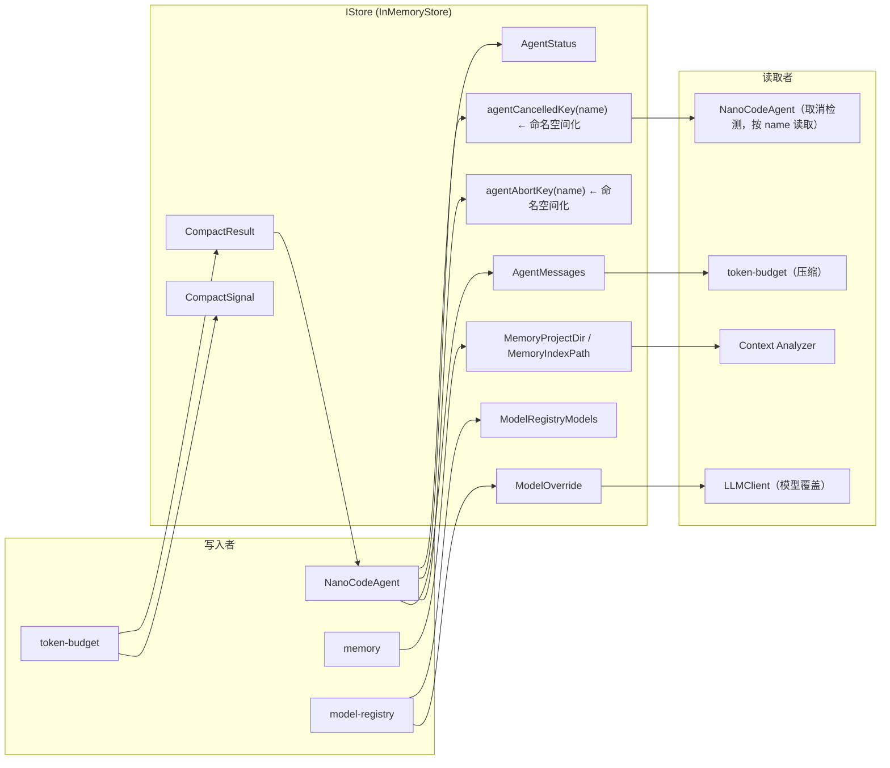

# ReAct 循环与 Plugin Hook 时序图

> 本文档描述了 nano-code 的 ReAct 循环、Plugin Hook 接口以及各类型插件在调用链中的职责。

## 核心概念

nano-code 的 ReAct（Reasoning + Acting）循环实现于 `NanoCodeAgent.runTask()`，核心流程为：

```
用户输入 → [拦截插件] → System Prompt 构建 → LLM 请求 → 工具调用 → 结果反馈 → 下一轮 / 结束
```

期间通过 **PluginRegistry** 的 Pipe / Chain / Broadcast 三种模式分发 `NanoPlugin` hook 调用，和 **DisplayPlugin** 的事件通知。

---

## 一、Plugin Hook 接口总表

所有 hook 定义在 `NanoPlugin` 接口（`src/core/plugin.ts`），按调用阶段分组：

### 1. 生命周期

| Hook | 模式 | 触发时机 | 参数 | 典型用途 |
|------|------|----------|------|---------|
| `onInit(registry)` | 异步广播 | `registry.register()` 末尾 | PluginRegistry 实例 | 注册 MCP 客户端、创建监听器 |
| `onDestroy()` | 异步广播 | `registry.unregister()` / `destroy()` | 无 | 清理子进程、关闭连接 |
| `onAgentReady(ctx)` | 异步广播 | `NanoCodeAgent` 构造后 | `AgentReadyContext` | 获取 agent/display 引用 |
| `onSessionRestore(ctx)` | 异步广播 | `--continue` 恢复会话时 | `SessionRestoreContext` | 恢复 token 计数 |

### 2. System Prompt

| Hook | 模式 | 触发时机 | 参数 | 返回值 | 典型用途 |
|------|------|----------|------|--------|---------|
| `onSystemPrompt(prompt)` | **Pipe** | 每轮 LLM 请求前 | 当前拼接的 prompt | `string` | 注入行为规则、角色定义 |

### 3. LLM 请求前后

| Hook | 模式 | 触发时机 | 参数 | 返回值 | 典型用途 |
|------|------|----------|------|--------|---------|
| `onBeforeRequest(messages)` | **Pipe** | 发送 LLM 前 | `ChatMessage[]` | `ChatMessage[]` | 压缩消息、追加系统提示 |
| `onAfterRequest(response, rawMeta?)` | **Broadcast** | LLM 响应后 | `LLMResponse` + 原始元数据 | `void` | 记录 token 用量、性能统计 |
| `onExtraParams()` | **累加Merge** | 发送 LLM 前 | 无 | `Record<string, unknown>` | 注入 API 额外参数（如 `response_format`、自定义 `stop`） |

### 4. 工具调用前后

| Hook | 模式 | 触发时机 | 参数 | 返回值 | 典型用途 |
|------|------|----------|------|--------|---------|
| `onBeforeToolCall(toolCall)` | **Chain** | 执行工具前 | `ToolCall` | `ToolCall \| null` | 拦截/修改工具调用参数 |
| `onAfterToolCall(result)` | **Pipe** | 工具执行后 | `ToolResponse` | `ToolResponse` | 装饰/修改工具结果 |

### 5. 用户输入拦截

| Hook | 模式 | 触发时机 | 参数 | 返回值 | 典型用途 |
|------|------|----------|------|--------|---------|
| `onBeforeAgentInput(input)` | **Chain** | 用户输入后、发 agent 前 | `string` | `CommandInterceptResult \| null` | 斜杠命令、`!` bash、agent 切换 |

### 6. 工具定义与执行

| Hook | 模式 | 触发时机 | 参数 | 返回值 | 典型用途 |
|------|------|----------|------|--------|---------|
| `getTools()` | **同步** | `getAllSchemas()` / 注册时 | 无 | `ToolDefinition[]` | 声明工具 schema（LLM tool definition） |
| `execute(name, args, ctx)` | **异步** | 用户/LLM 触发 | 工具名 + 参数 + 上下文 | `ToolResponse` | 实际执行文件读写、命令运行等 |

---

## 二、Dispatch 模式说明

`PluginRegistry` 通过三种方式分派 hook：



| 模式 | 实现方法 | 行为 |
|------|----------|------|
| **Pipe** | `execPipe(hook, initial)` | 顺序传递，前一插件输出作为下一插件输入 |
| **Chain** | `execBeforeToolCall()` / `execBeforeAgentInput()` | 顺序调用，任一返回 null / handled=true 则停止 |
| **Broadcast** | `execBroadcast(hook)` | 所有插件都收到相同参数，独立执行，互不影响 |
| **Merge** | `collectExtraParams()` | 遍历插件，用 `Object.assign` 合并所有返回值 |

---

## 三、ReAct 循环完整时序图



---

## 四、各类型 Plugin 的 Hook 职责矩阵

### 系统插件（自动注册、不可禁用）

| 插件 | onInit | onSystemPrompt | onBeforeRequest | onAfterRequest | getTools + execute | 其他 |
|------|--------|---------------|-----------------|----------------|-------------------|------|
| **fs** | — | — | — | — | 文件读/写/列表/编辑 | — |
| **command** | — | — | — | — | Bash 执行 | — |
| **memory** | 创建记忆目录 | 注入 AGENT.md + MEMORY.md 索引 | — | — | save_memory / recall_memory | — |
| **token-budget** | — | — | **自动压缩**消息历史 | **累计 token 用量** | — | onSessionRestore 恢复计数 |
| **file-search** | — | — | — | — | glob/grep 搜索 | — |
| **mcp-loader** | **加载 MCP 插件**（stdio/HTTP） | — | — | — | — | 动态注册子插件 |

### Feature 插件（可通过 config 禁用）

| 插件 | onBeforeAgentInput | getTools + execute | 其他 |
|------|-------------------|-------------------|------|
| **skills** | — | skill/skills_list/skill_view/run_agent | 内建技能 + 文件系统 SKILL.md |
| **coordinator** | 拦截多 agent 指令 | — | 创建/路由子 agent |
| **commands** | 拦截 `/` 命令路由 | — | 继续分发给 skills-slash / agent-slash / bang / task-plan |
| **skills-slash** | `/skill-name` 匹配执行 | — | — |
| **agent-slash** | `@agent-name` 匹配切换 | — | — |
| **bang** | `!` bash 快捷执行 | — | — |
| **task-plan** | `/plan`、`/task` 命令 | — | — |
| **npm-loader** | — | — | onInit 动态 import npm 包为插件 |

---

## 五、Store（插件间共享状态通道）

`PluginRegistry.store` 是一个 `IStore`（`src/core/store.ts`），所有 key 定义在 `store-keys.ts`。



---

## 六、Display 接口体系

### DisplayPlugin（完整接口，`src/display.ts`）

```
onInit(registry)          — 注册 confirmCallback、outputHandler 等到 registry
onStart(config)           — 展示欢迎界面、启动 UI
prompt()                  — 获取用户输入（REPL 用 clack.text，Ink 用 useInput）
onUserInput(input, src)   — 用户输入通知所有 display
onStatus({ message, ... })        — 状态消息（thinking、info、warn、error）
onStreamChunk({ text, ... })       — LLM 流式文本块
onToolCall({ toolName, args })     — 工具调用开始
onToolResult({ status, message })  — 工具调用结果
onError({ message, stack })        — 错误通知
onAgentTurnStart / onAgentTurnEnd  — Agent 回合生命周期
onStateSnapshot({ messageCount })  — 每轮消息数快照
onContextAnalysis(analysis)        — 上下文分析可视化
onBackgroundTask({ ... })          — 后台任务状态
```

### AgentDisplay（窄接口，`src/core/contract.ts`）

`NanoCodeAgent` 只依赖 `AgentDisplay` 子集（`src/core/contract.ts`），适配器模式由 `DisplayManager.asAgentDisplay()` 提供：

```
onStatus()
onStreamChunk()
onToolCall()
onToolResult()
onStateSnapshot()
onAgentTurnStart()
onAgentTurnEnd()
```

---

## 七、关键设计决策

1. **Hook 分派模式选择**
   - **Pipe**（`onSystemPrompt`、`onBeforeRequest`、`onAfterToolCall`）：需要有序串联，前一插件输出是下一插件输入
   - **Chain**（`onBeforeToolCall`、`onBeforeAgentInput`）：任一插件可终止整条链（返回 null / handled=true）
   - **Broadcast**（`onAfterRequest`、`onInit`、`onDestroy`）：独立通知，互不依赖
   - **Merge**（`onExtraParams`）：各插件独立贡献部分配置，目标对象合并

2. **工具级超时覆盖**
   - `ToolDefinition.function.timeout` 支持为每个工具设定独立超时，未指定时使用全局 `defaultTimeout`（默认 120s）
   - `Infinity` 表示永不超时（`ask_user_question` 等交互式工具），跳过 `PluginRegistry.execute()` 的 `Promise.race` 超时包装
   - 按工具粒度存储于 `PluginRegistry.toolTimeouts` map，与 `toolSideEffects` 相同的登记/清理模式

3. **Read-only 工具并行 + Write 工具串行**
   - `sideEffect: false` 的 read-only 工具（如文件读、搜索）通过 `Promise.all` 并行执行
   - `sideEffect: true` 的 write 工具（文件写、命令执行）串行执行，保持顺序和权限流

4. **Store 为隐式协议**
   - 核心不知晓 Store key 的业务含义，谁 set 谁定义结构
   - `store-keys.ts` 集中管理所有 key 常量，使协议可追踪
   - `agentCancelledKey(name)` / `agentAbortKey(name)` 等命名空间化 key 函数，支持按 agent 名称隔离取消/中止信号

5. **AgentDisplay 窄接口**
   - `NanoCodeAgent` 只依赖 `AgentDisplay` 5 个方法，不依赖完整 `DisplayPlugin`
   - `DisplayManager` 通过 `asAgentDisplay()` 适配两个接口
   - 这样 display 层可独立替换而不影响 agent 核心逻辑
